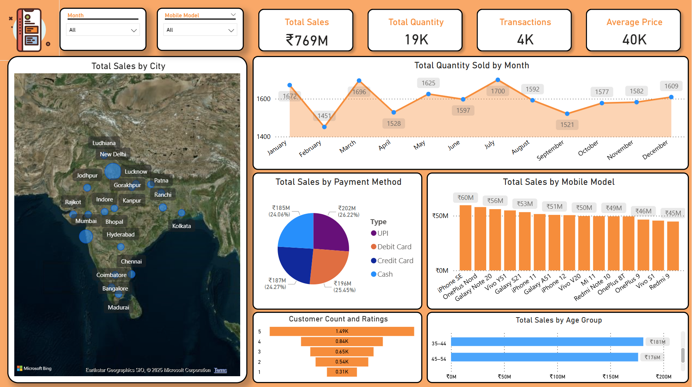
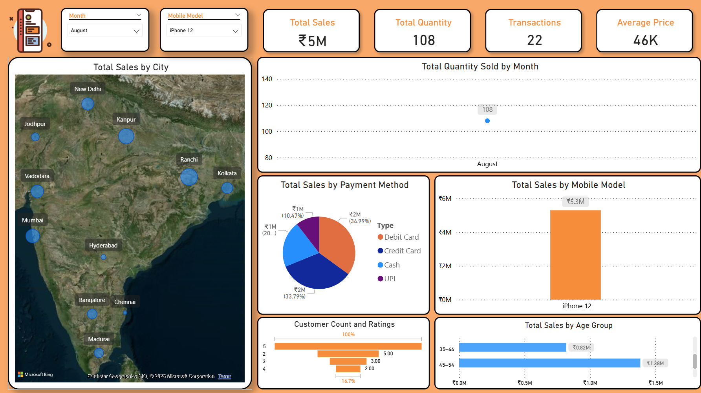
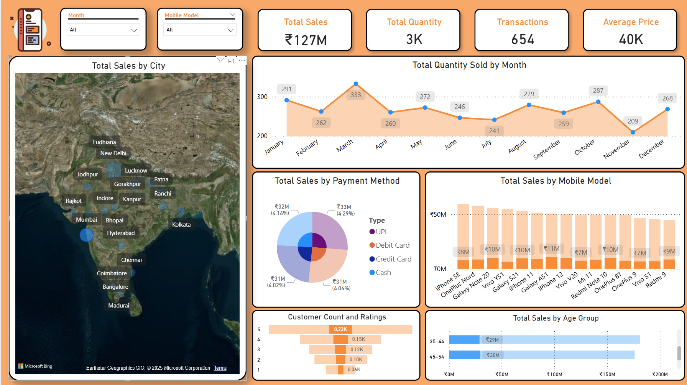

# Phone Sales Dashboard - Power BI

# Dataset
Dataset: Sample data in `/data/`

## Play Around
Open Report in Power BI Desktop, or use `Mobile Dashboard.pbix`.

## Data Transforamtions
- Change Data types to show appropriate columns
- Reorder/remove unnecessary columns
- Added custom column by combining different attributes
- Bin Ages to Age groups for better visualizations

## Screenshots

