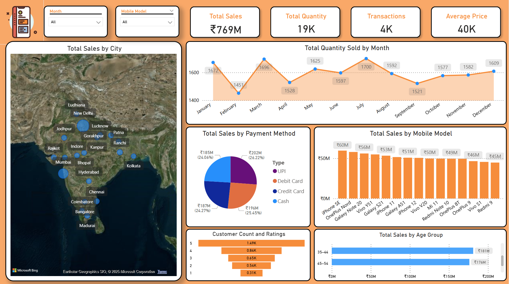
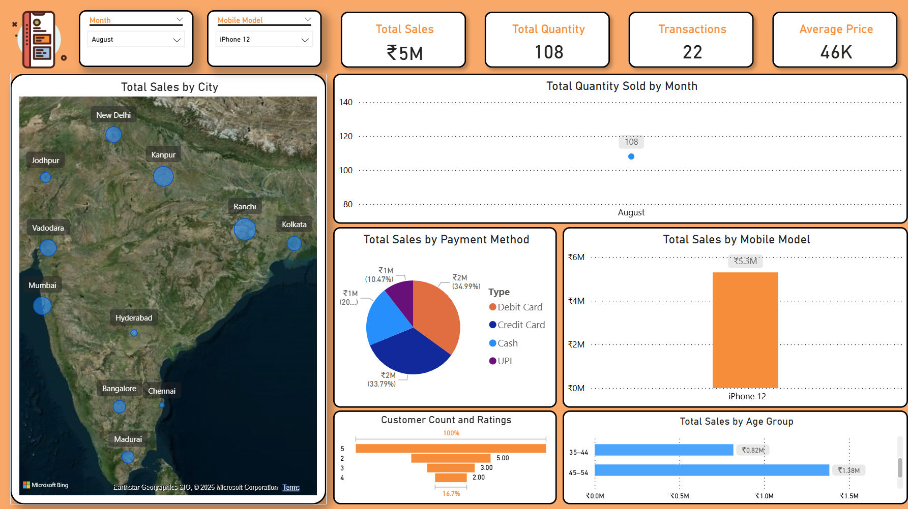
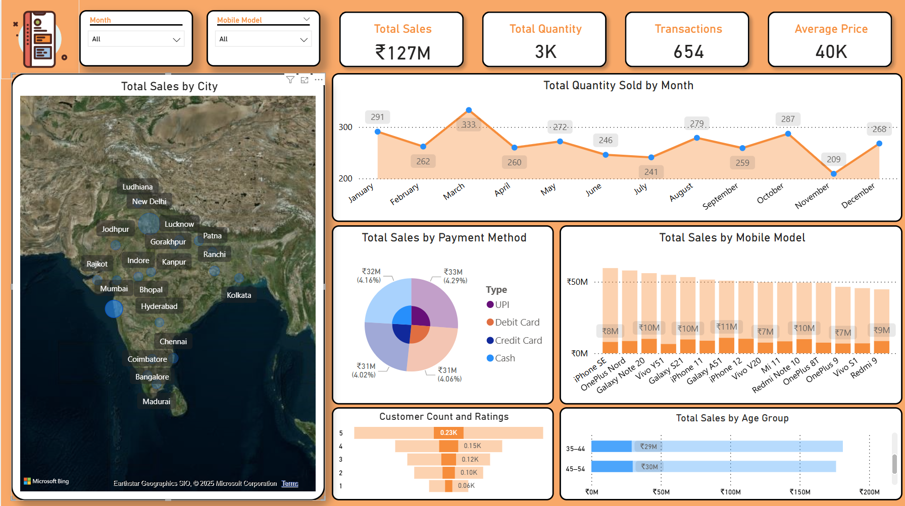

# Phone Sales Dashboard - Power BI

## Dataset
Dataset: Sample sales data in `data`

## Play Around
Open Report in Power BI Desktop, or use `Mobile Dashboard.pbix`.

## Utilize
- Power BI Desktop
- Power Query Editor – for data cleaning and transformation
- DAX – for custom KPIs and calculated columns, example Age Bins for better visualizations
- Interactive Visuals – KPI Cards, Pie, Bar, Area Charts and Map View

# Screenshots

## Overview of Dashboard

## Drilldown view by using Slicers

## Filtering via Map view 

